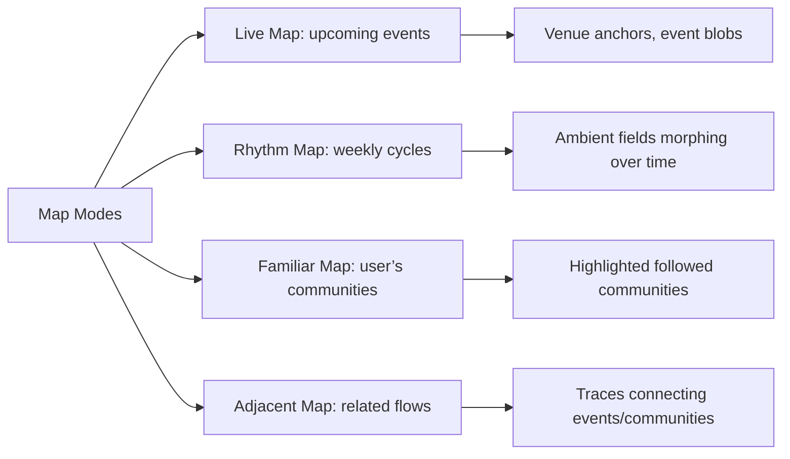
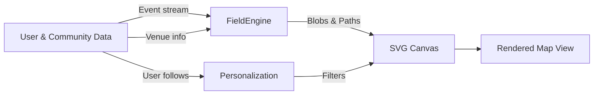

# Deep Research on Community Participation Platform UX/UI Design

## Executive Summary

Designing a *community participation platform* around orientation and rhythms requires blending classic UX principles with novel spatial/temporal interfaces. Key guidelines are:

- **Clarity & Hierarchy:** Follow Nielsen–Norman heuristics: make important features visible and easy (recognition > recall, clear feedback). Use Gestalt principles (common region, proximity) to group related info【1†L124-L132】【1†L159-L162】. Keep the interface simple – apply *progressive disclosure*【27†L79-L83】 so users see only core options until they request more.

- **Orientation-First Home:** The landing page should *invite choice* not demand it. Present a few large “windows” (Continue, Explore, Rhythm, etc.) with *minimal text and rich previews*. Highlight one primary action (single strong CTA【6†L127-L135】) and reveal additional modes secondarily. Use recognition cues (user name/location, followed communities) to make users feel at home.

- **Map & Rhythm Visuals:** Implement multiple map modes. A *Live Map* shows upcoming events as bounded kernels and venue anchors. A *Rhythm Map* shows ambient community fields morphing through the week. A *Familiar Map* highlights followed communities. An *Adjacent Map* draws traces between related events/communities. Use soft color blends for overlapping communities (using perceptual color spaces【21†L65-L74】). Animate only to clarify (time scrubbing, trace drawing), not incessantly.

- **Personalization & Ethics:** Allow users to select a “stance” each visit (e.g. Continue/Explore/Deepen/Create/Rest) so the UI adapts to their intent without enforcing an identity. Incorporate preferences lightly (followed communities/tags) but always encourage serendipity. Design ethically: be transparent about recommendations, minimize tracking, respect GDPR (consent, data minimization). Avoid filtering bubbles – mix familiar and new to broaden horizons【16†L224-L231】.

- **Accessibility:** Build to WCAG 2.1 standards. Ensure keyboard/ARIA support for maps (e.g. focusable event markers with text descriptions). Don’t rely on color alone. Provide alt text for visual elements and high contrast. Check animations against motion sensitivity.

- **Visual Language:** Use a coherent visual style: a limited palette, ambient gradients, clear icons. Encode data meaning in shape and size (not just color). Color-blend overlapping communities in a perceptually uniform way【21†L65-L74】. Use SVG overlays for interactive map layers (better accessibility)【25†L147-L157】, switching to Canvas only for very large data. 

- **Interactions:** Onboarding should gently explain modes. Use microcopy that is inviting and humble (“Discover what’s happening” vs “Sign up now!”). Provide inline help (tooltips for jargon). Follow “recognition, not recall” by surfacing user’s interests and activities directly【10†L69-L72】.

- **Validation:** Use mixed methods: usability tests, interviews with facilitators and participants, KPI tracking (e.g. event RSVP rates, first→second attendance conversions). A/B test home variants. Key metric: *meaningful participation rate* (attendance + continued engagement).

Below is a detailed guide across these themes.

---

## 1. UX/UI Principles & Heuristics

- **Nielsen’s Usability Heuristics:** Apply **visibility**, **feedback**, and **consistency**. Always show system status (e.g. loading maps or saving events). Make navigation and controls predictable. Use “recognition over recall”【10†L69-L72】: e.g. show community names and icons, not empty search boxes.

- **Cognitive Load & Simplicity:** Limit on-screen elements. *Progressive Disclosure* is key【27†L79-L83】: initially present only the most common tasks (e.g. “Join Event”, “Follow Community”), hide less-used options behind “More…” or later steps. For example, group all schedule filters under an “Advanced filters” dialog, not all at once.

- **Gestalt Grouping:** Use spatial grouping to show relationships【1†L159-L162】. For example, cluster map filters and legend together with clear boundaries. On the community page, group membership vs events vs guidelines in separate card sections.

- **Visual Hierarchy:** Make the most important element the largest/brightest. On home, highlight one “primary” action (e.g. the Rhythm preview) and use smaller panes for others. Use whitespace to avoid crowding. Large text headers should stand out, smaller text for details.

- **Affordances & Feedback:** Buttons should look clickable; maps should indicate interactive areas (e.g. hover highlight). Provide clear feedback: when a user follows a community or saves an event, update counts or show a brief confirmation.

- **Accessibility (WCAG 2.1):** Ensure all functionality is keyboard-accessible. For maps, support keyboard focus for interactive overlays【25†L147-L157】. Provide ARIA labels and alt text for icons and map elements. Use high-contrast color schemes (especially for text) and avoid color-only cues.

- **Privacy by Design:** Embed GDPR principles: require consent for personal data (even location or email) and minimize data collection. For example, if localizing content by city, do so via user input rather than GPS. Allow users to delete their data or opt-out of tracking.

---

## 2. Orientation-First Home Page Patterns

A home page should **orient** the user, not overwhelm them. Key patterns:

- **Single Hero/Question:** Start with a welcoming headline, e.g. “How would you like to be with the field today?” under which the main action stands out (like “Explore Nearby” or “Continue Your Groups”)【6†L127-L135】.

- **Windowed Options:** Present 3–4 large “windows” or cards rather than long lists. Each window corresponds to a mode: *Continue*, *Explore*, *Rhythm*, *Deepen*, *Create*, *Rest*. Inside each, show only a 1–2 item preview with an inviting image or icon. Avoid paragraphs of explanation; use a short phrase.

- **Preview-First:** Instead of text menus, populate each window with actual content from the user’s data or the local community. E.g. “Your groups: CI Aarhus, Somatic Circle” with an icon, or a small map snippet. This uses *recognition*【10†L69-L72】.

- **Progressive Disclosure:** Not all modes need to be visible at once. The initial screen might show 2–3 main windows; a “More ways to be with the field” link can expand or slide up the rest. This keeps the initial view light.

- **Primary CTA Highlight:** Only one window (or one button) should be visually dominant (largest size or accent color) to indicate the recommended first step【6†L127-L135】. Secondary options can be smaller or less emphasized.

- **Visual Metaphors:** Use imagery to convey mode. For “Rhythm,” perhaps an animated weekly wheel icon; for “Explore,” a cluster of icons/path lines; for “Continue,” a warm scene of people in known space. These metaphors help users immediately grasp the concept without reading text.

- **Consistent Layout:** Maintain a predictable layout. For instance, always put “Continue” on the left, “Explore” on the right. Use consistent headings (e.g. H2 for titles) and spacing.

- **Legibility:** Use font sizes and contrasts that are easy to read. Each window’s title (e.g. “Taste New Connections”) should be larger than its preview bullet points【6†L127-L135】.

- **Transition to Next Screen:** Windows should link directly to relevant views. For example, tapping “Rhythm” goes to the cyclical map view, “Explore” to the live map, etc.

---

## 3. Map & Rhythm Visualization Patterns

### Map Overview and Interaction

A spatial UI requires careful design:

- **Multiple Map Modes:** Implement distinct modes, not just filters:
  - **Live Map:** Shows upcoming *events* as bounded glyphs (circles or icons) at venues, color-coded by community, sized by attendance. Venue anchors (e.g. small squares) mark locations with recurring activity.
  - **Rhythm Map:** Displays *ambient fields* (blobby gradients) over areas to indicate typical activity times. Fields morph over time (e.g. Monday through Sunday) to reveal “when and where the field is alive”.
  - **Familiar Map:** Highlights user’s followed communities (their fields in bright color, others faded) and saved events. Emphasize known locations.
  - **Adjacent Map:** Lets user pick an event or community, then draws *traces* or connecting lines to related events/communities (based on participant overlap or topic similarity).
  - **Wider Field Map:** Abstract view of multiple cities: city nodes sized by activity, with lines showing common links (e.g. many participants traveling between Aarhus–Copenhagen).

- **Ambient Fields:** Use soft, translucent colored shapes behind or around clusters of events to suggest community “presence”. For example, a gentle blue glow around venues with many CI events. Blend overlapping fields in color (for CI+Circling, show a color mix).

- **Event Kernels:** Represent specific events as discrete blobs/icons. Use a filled circle or rounded rectangle. Encode: 
  - **Size:** (e.g. small for workshops, large for festivals or high RSVPs).
  - **Color:** primary community. If multi-community, overlay two-tone border or use striped fill.
  - **Outline:** solid (public) vs dashed (members-only) to indicate access. 
  - **Iconography:** maybe a small icon for event type (dance, circle, etc.).

- **Traces & Flows:** In “Adjacent” mode, draw lines/arrows between events or communities to illustrate connections. For instance, animate a line from a Wednesday CI event to a Thursday dance event to show participant overlap. Use dashed or colored lines with slight animation (e.g. moving dots) to imply direction/time.

- **Time Control:** Overlay each map with a time slider or wheel:
  - **Live Map:** Date picker/slider for upcoming week. 
  - **Rhythm Map:** A circular week-view scrubber (Mon→Sun) or slider. As time moves, the fields and event kernels update (morph size/color).
  - Animations should be smooth (200–400ms) but not continuous auto-scroll (user control is better).

- **Interaction:** Clicking an event opens its detail card (title, host, communities, description). Clicking a community field shows an overview (“This community usually meets here at these times”). Zooming/panning should be fluid (use Leaflet).

### Tables & Figures (Examples)

| **Pattern**            | **Use Case**                                   |
|------------------------|------------------------------------------------|
| **Live Events Map**    | User browsing current/upcoming events; find “what’s on tonight.” |
| **Rhythm Calendar Map**| Discover habitual activity (e.g. “Thursdays are lively at VenueX”). |
| **Familiar Map**       | User wants to quickly locate their groups’ events. |
| **Adjacent Flows**     | Suggest related events beyond user’s circle (e.g. “others go to this too”). |
| **City Exchange Map**  | Identify major hubs and travel patterns among community cities. |



---

## 4. Interaction Patterns (Onboarding, Personalization, Modes)

- **Onboarding:** A brief tutorial or progressive tour can explain the *stance modes*. Use animated pointers or short tooltips (“Tap ‘Explore’ to see new events”). Keep it skippable. Provide clear “Next” steps.
  
- **Dynamic Stance Selection:** Let the user choose a mode each session (Continue, Explore, Deepen, Create, Rest). This might be via tabs or a segmented control on the home page. Each mode then tailors the UI (e.g. an Explore stance opens the Live Map by default).  
  - **“Continue”:** Show familiar elements (their communities/events).
  - **“Explore”:** Show Live Map and highlight new events.
  - **“Deepen”:** Emphasize recurring series and labs in their groups.
  - **“Create”:** Present event creation tools; suggest communities to reach.
  - **“Rest”:** Show a calm summary (“Nothing urgent. Relax. See your commitments”).

- **Personalization (Lightweight):** Instead of profiling the user deeply, infer from simple actions: which communities they follow, what events they RSVP. Default to not logged-in first; then capture choices (favorites, profile) gradually. Allow users to select interests at any time (tags for practices).

- **Privacy by Design:** Always ask before sending notifications (GDPR compliance). Allow opting out of personalization (e.g. “Use incognito mode – we won’t save your history”). No dark patterns (“1 seat left!” must actually be real urgency).

- **Non-Extractive Recommendations:** When suggesting events, provide context (“Suggested by Circling Aarhus” or “40% of your CI circle is attending”) to build trust and avoid black-box feeling.  

- **Failure States:** If no events match criteria, offer alternatives gently (“No events right now. Here are volunteer or learning opportunities instead.”).

---

## 5. Accessibility & Ethics

- **Privacy & Ethics:** Follow GDPR/DSA:
  - **Data Minimization:** Only store identity info if needed for login or customization. E.g., use pseudonymous IDs for participation tracking.  
  - **Consent:** Before using location or sending email invites, ask permission. Clearly explain data use (e.g. “Sharing your calendar lets friends see when you attend events”).  
  - **Transparency:** Provide “Why this?” for recommendations to prevent filter bubbles【16†L224-L231】.  
  - **Bias & Inclusion:** Actively present diverse community voices. For example, avoid only highlighting the largest groups. If teams are racially/gender diverse, reflect that in imagery.  

- **Accessibility:** All icons/buttons must have keyboard focus and ARIA labels. For the map, ensure every interactive element can be reached and described (e.g. focus an event shows a sidebar text). Use alt text for static images. Test color contrast (WCAG AA 4.5:1). Do not rely solely on color to convey info; use shapes or patterns where needed.  

- **Motion Sensitivity:** Provide a setting to reduce animation. Avoid motion sickness triggers: no fast parallax, minimal auto-scroll. Allow pausing/cancelling any auto-play.

---

## 6. Visual Language and Animation

- **Color & Blending:** Choose ~5–7 distinct base colors for main communities. Use subdued tints for secondary usage. When blending (overlap), use perceptually uniform blending (CIE-LCh)【21†L65-L74】. 
- **Typography:** Use a clean, sans-serif font. Hierarchy: H1 for page title, H2 for window titles, normal text for descriptions. Emphasize key labels in bold.
- **Icons & Glyphs:** Use a consistent icon set. Venue icon (square), event icon (circle), community icon (circle with logo). Provide text labels or tooltips.
- **Gradients and Fields:** Ambient fields can use radial gradients fading out. For example, CI community might emit a blue glow that softly spreads around relevant venues.
- **Animation Guidelines:** 
  - Animate only on user-trigger or transitions (no constant motion). 
  - Time scrubbing: smoothly interpolate field shapes (300–500ms). 
  - Traces: draw lines incrementally (with easing) to show flow.
  - UI feedback: button clicks with short highlight (100ms).
  - **Performance:** Aim for 60fps on modern devices. Use CSS transitions or canvas only when necessary. 
- **Chart – Animation Sensibility:**

| Animation Type        | Use Case                          | Guidelines                           |
|-----------------------|------------------------------------|--------------------------------------|
| **Time Slider**       | Scrubbing through week            | Smooth 300ms interpolation; allow pause |
| **Hover Highlights**  | On event/venue hover              | 150ms fade-in highlight; subtle       |
| **Map Transitions**   | Switching modes/views             | Slide/fade content, ~200ms           |
| **Traces Drawing**    | Showing adjacency flows           | Animated line drawing with easing    |
| **Idle Motion**       | (Avoid)                           | None or very subtle (to avoid distraction) |

---

## 7. Implementation & Prototyping

- **Technology Stack:** Use a modern JS framework (React/Vue) with Leaflet for map. Render dynamic shapes with **SVG overlays** for accessibility【25†L147-L157】. If data grows large, consider Canvas layer for performance【25†L195-L204】.  
- **Data Model:** For example:

  | Entity      | Key Fields                                              |
  |-------------|---------------------------------------------------------|
  | **Event**   | id, title, startTime, endTime, venueId, communityIds[], attendeeCount, isPublic |
  | **Venue**   | id, name, lat, lon, address, capacity, accessibilityInfo |
  | **Community**| id, name, color, description, onboardingGuidelines, tags |
  | **Person**  | id, name, photoURL, followedCommunityIds[], savedEventIds[] |
  | **FieldState**| venueId, timeBucket (e.g. Thu 7pm), intensity, communityWeights{} |

- **Rhythm Engine:** Pre-compute “FieldState” for each venue × time period (e.g. hourly or by AM/PM, or day-of-week slots). Intensity = f(event count × avg attendance). CommunityWeights = normalized sum of event community vectors. Regularity = variance of events over weeks.  
- **Adjacency Score (sample formula):**  
  ```
  score = 0.4*participantOverlap + 0.3*communitySimilarity + 0.2*tagSimilarity + 0.1*venueProximity
  ```
  (Weights are assumptions; tune with data).  
- **Mermaid Data Flow:**



- **Prototyping:** Use Figma/Sketch for UI mockups. Test data flows in a staging environment. Develop a minimal field-engine module to simulate fields, then connect to Leaflet.

- **Performance:** Assume up to ~100 events active per week in a city. SVG should handle hundreds of elements; canvas fallback if thousands. Cache heavy computations (e.g. daily pre-calc of fields).

---

## 8. Tone and Microcopy

- **Friendly & Encouraging:** Use warm, inclusive language. E.g. “Dive into the field” or “Find your rhythm”, not “Enroll now”.  
- **Non-Prescriptive:** Phrases like “You might like…” instead of “You should…”. Let users feel autonomy.  
- **Transparent:** When recommending, explain: “Suggested because 5 of your friends are going.”  
- **Inviting CTAs:** “Continue” / “Explore” / “Create” are better than “Submit” or “Next”.  
- **Error Messages:** Gentle fixes: “Oops, no events found – try expanding your search or check back later.”  
- **Help Text:** Minimal, contextual hints (e.g. “Click on a community to learn more about joining”).

## 9. Validation & Metrics

- **Usability Testing:** Conduct task-based tests (e.g. find next CI event, join a community). Observe where users hesitate.  
- **Diary/Field Studies:** Let stewards/facilitators use a pilot app for weeks to gather qualitative data on community impact.  
- **KPIs:** 
  - **Engagement:** % users who RSVP after viewing event, week-2 retention. 
  - **Discovery:** Rate of switching communities (cross-post attendance). 
  - **Conversion:** # of new community follows per week. 
  - **Qualitative:** NPS surveys of organizers (“Has this tool helped your community?”).  
- **A/B Testing:** Experiment with home page layouts (e.g. number of windows shown, CTA wording). Track “opt-in” to features (e.g. how often users choose “Rhythm” vs “Explore”).  
- **Accessibility Audit:** Use tools (axe, Lighthouse) and manual testing to ensure AA compliance.

---

## 10. Appendix: Checklist & Patterns

- **Home/Orientation:**  
  - [ ] Single clear focus (hero headline)  
  - [ ] Max 3–4 windows visible, with minimal text  
  - [ ] Recognition cues (user name, followed communities)  
  - [ ] One prominent CTA, others clearly secondary

- **Maps:**  
  - [ ] Distinct styles per mode (described above)  
  - [ ] Accessible overlays (SVG+ARIA)  
  - [ ] Legends or tooltips for color meaning  
  - [ ] Responsive (pan/zoom work on mobile/touch)

- **Interactions:**  
  - [ ] Mode selection easy to change  
  - [ ] Event create flow suggests communities via tags  
  - [ ] Member suggestions interface for events

- **Ethics/Privacy:**  
  - [ ] Cookie banner/consent for any tracking  
  - [ ] Clear privacy policy link  
  - [ ] Data deletion option

- **Visual/Animation:**  
  - [ ] Color palette tested with colorblind tools  
  - [ ] Animations toggle in settings  
  - [ ] Smooth transitions (e.g. 300ms ease-in-out)

- **Implementation:**  
  - [ ] Use Leaflet or Mapbox with custom SVG overlay layer  
  - [ ] Verify performance with 200+ markers  
  - [ ] Automated tests for data transformations

This research synthesizes best practices and literature【27†L79-L83】【10†L69-L72】【25†L147-L157】 into actionable design guidance for creating an intuitive, inclusive, and meaningful participation platform. 

**Key References:** UX heuristics【27†L79-L83】【10†L69-L72】; NN Group on cognitive load and forms【1†L124-L132】; ethics of personalization【16†L224-L231】; SVG vs Canvas【25†L147-L157】; color blending study【21†L65-L74】; accessibility guidelines【19†L28-L37】.